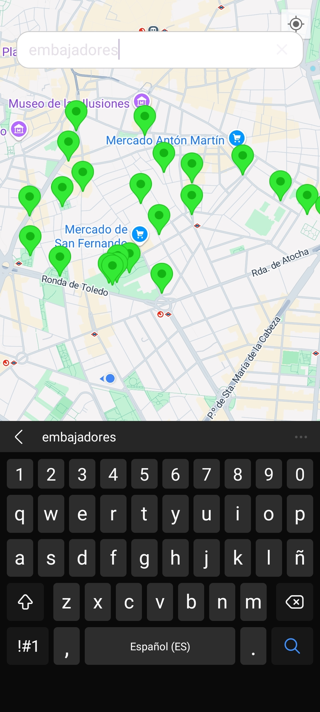

# Fontway

Una aplicación para encontrar fuentes de agua cercanas en su ciudad, ya sea para tu perro o para ti

>**Proyecto Integrador DAM2 24/25**

## 🚀 Cáracteristicas

- 🌍 Encuentra fuentes para personas o animales por tu zona.
- 💧 Información sobre el estado de la fuente (En mantenimiento, disponible, etc).

## 💡 Figma

[Visita el figma](https://www.figma.com/design/y6SO0lJ3bDAyEqmhDfegK7/FontWay?node-id=0-1&p=f&t=5FkMIhLwzE9Z5xBi-0)

## ⚙️ Funcionalidades Principales

- 📍 **Visualización en mapa**: Usando una API publica de la comunidad de madrid, visualiza las fuentes en un mapa usando google maps.

- 🔎 **Búsqueda de fuentes**: Permite encontrar las fuentes de una zona mediante un buscador.

 

- 🏷️ **Filtro de fuentes**: Herramietna que te permite filtrar las fuentes cercanas por :
  - Estado de la fuente(Operativa ,Cerrada temporalmente, Fuera de servicio).
  - Tipo de uso (Personas, Mascotas, Ambas).

## 🧑‍💻 Créditos

Proyecto realizado por:

- **Kevin Luis Laurente**
- **Armando Granados**
- **Bruno Veiga**