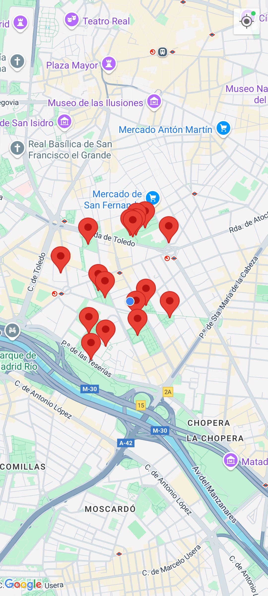
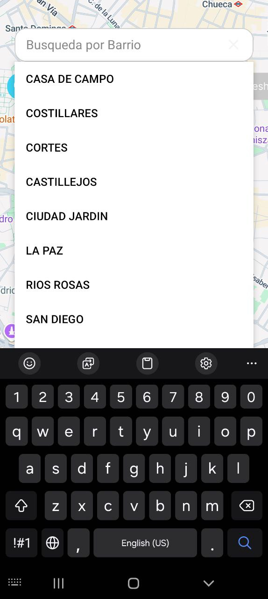
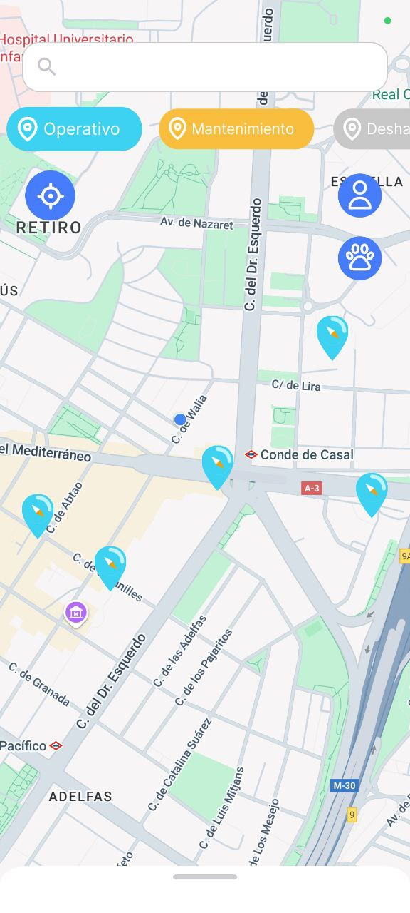
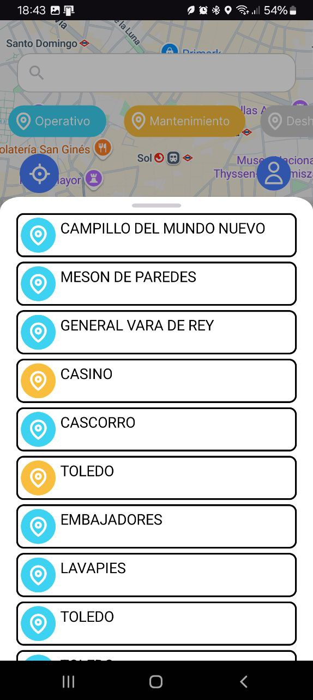

# Fontway

Una aplicación para encontrar fuentes de agua cercanas en tu ciudad, ya sea para tu perro o para ti.

> **Proyecto Integrador DAM2 24/25**

## 🚀 Características

- 🌍 Encuentra fuentes para personas o animales en tu zona.
- 💧 Información sobre el estado de la fuente (en mantenimiento, disponible, etc.).
- ⚙️ Aplica filtros a las fuentes visualizadas.

## 💡 Figma

  

[Visita el Figma](https://www.figma.com/design/y6SO0lJ3bDAyEqmhDfegK7/FontWay?node-id=0-1&p=f&t=5FkMIhLwzE9Z5xBi-0)

## ⚙️ Funcionalidades principales

- 📍 **Visualización en mapa**: Utilizando una API pública de la Comunidad de Madrid, la aplicación muestra las fuentes en un mapa con Google Maps.

  

- 🔎 **Búsqueda de fuentes**: Permite encontrar las fuentes de una zona mediante un buscador.

  

- 🏷️ **Filtro de fuentes**:
  - Estado de la fuente (Operativa, Cerrada temporalmente, Fuera de servicio).
  - Tipo de uso (Personas, Mascotas, Ambas).

  

- 📋 **Barra inferior**:
  - La aplicación cuenta con una barra inferior que facilita la ubicación de fuentes cercanas.

  

## 🧑‍💻 Créditos

Proyecto realizado por:

- **Kevin Luis Laurente**
- **Armando Granados**
- **Bruno Veiga**  
